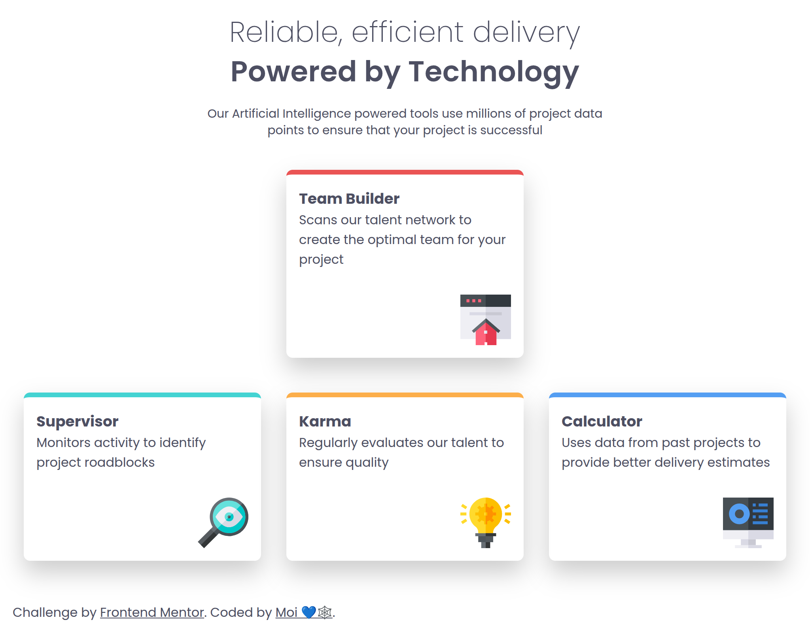

# Frontend Mentor - Four card feature section solution

This is a solution to the [Four card feature section challenge on Frontend Mentor](https://www.frontendmentor.io/challenges/four-card-feature-section-weK1eFYK). Frontend Mentor challenges help you improve your coding skills by building realistic projects.

## Table of contents

- [Overview](#overview)
  - [The challenge](#the-challenge)
  - [Screenshot](#screenshot)
  - [Links](#links)
- [My process](#my-process)
  - [Built with](#built-with)
  - [What I learned](#what-i-learned)
- [Author](#author)

## Overview

### The challenge

Users should be able to:

- View the optimal layout for the site depending on their device's screen size

### Screenshot



### Links

- Solution URL: [https://github.com/mnav08/card-feature-section.git]
- Live Site URL: [https://mnav08.github.io/card-feature-section/]

## My process

### Built with

- Semantic HTML5 markup
- CSS custom properties
- Flexbox
- CSS Grid
- Mobile-first workflow

### What I learned

I learned responsive design and to asses what option is best ,flex-box or grid, witht he constraints I have.
In addition learned how to remove from the layout a parent container that is nested inside another parent container. This to make it's children part of the outside parent. Also practice using grid template areas & target element using pseudo classes

```css
.flex-col {
  display: contents;
}
```

```css
.cards-wrapper {
  grid-template-areas:
    ". team ."
    "sup calcu karma";
}

.cards-wrapper > .content:nth-child(1) {
  grid-area: sup;
}

.flex-col > .content:nth-child(1) {
  grid-area: team;
}

.flex-col > .content:nth-child(2) {
  grid-area: calcu;
}

.cards-wrapper > .content:nth-child(3) {
  grid-area: karma;
}
```

## Author

Moises N 💙🕸️

- Website - [https://mnav08.github.io/portfolio-website/](https://mnav08.github.io/portfolio-website/)
- Frontend Mentor - [@mnav08](@mnav08)
